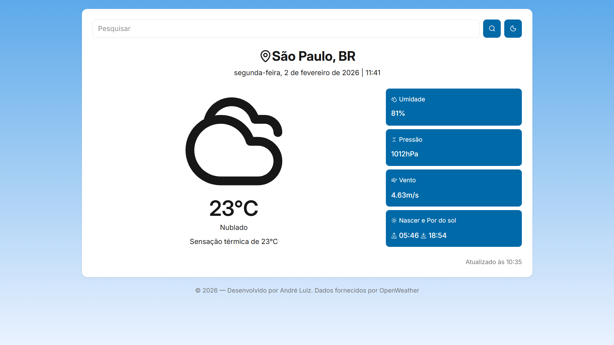
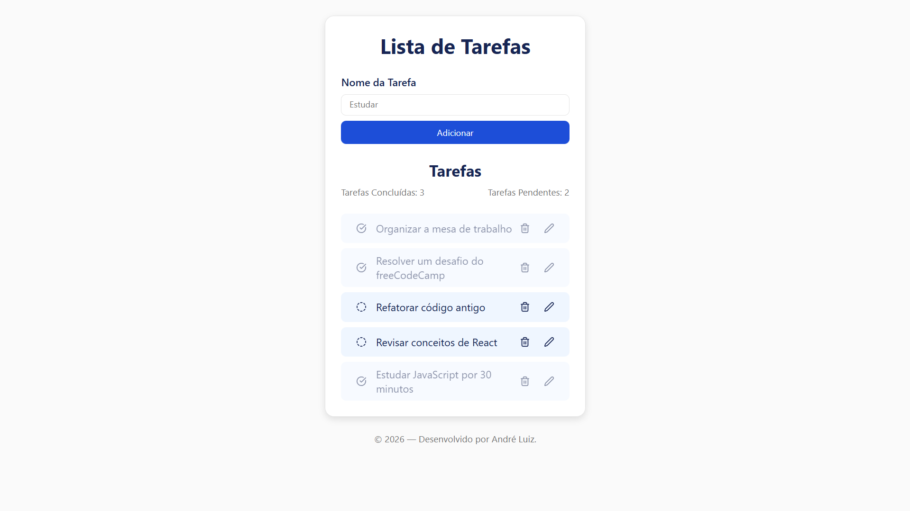

# Olá, me chamo André Luiz 👋

## Sobre mim

Sou graduando em Sistemas de Informação, com interesse em Desenvolvimento Front-end.

Durante minha formação, realizei estágio na área de desenvolvimento web, onde tive a oportunidade de desenvolver uma página para o Sistema de Gestão Escolar da empresa em que atuei. Essa página tinha como objetivo identificar o estilo de aprendizagem dos alunos.

Atualmente, estou me dedicando a aprimorar meus conhecimentos em desenvolvimento Front-end, estudando e praticando tecnologias e frameworks como React, TypeScript, Next.js e Tailwind CSS, sempre buscando escrever código limpo, legível e alinhado às boas práticas de programação.

## 🛠️ Tecnologias e Ferramentas

### Principais

  
  
  
  
  

### Já utilizei

  
  
  
  
  
  
  
  
  
  
  
  
  

### Em estudo

  
  
  
  
  
  
  

## 🖥️ Projetos

<table width="75%">
    <tr>
        <td style="border: 1px solid; padding: 20px" valign="top">
            
            

                <a href="https://github.com/andreluizpo/to-do-list"><b>☀️ Weather App</b></a>
            

            

                Aplicação web que permite consultar informações climáticas em tempo real a partir do nome de uma cidade,
                exibindo dados como temperatura, sensação térmica, umidade, vento, horário local, nascer e pôr do sol.
            

        </td>
        <td style="border: 1px solid; padding: 20px;" valign="top">
            
            

                <a href="https://github.com/andreluizpo/to-do-list"><b>✅ To-Do List</b></a>
            

            

                Aplicação de lista de tarefas desenvolvida com <b>React + TypeScript</b>, permitindo criar, editar,
                concluir e remover tarefas, com salvamento dos dados no <b>Local Storage</b>.
            

        </td>
    </tr>
</table>

<!-- ## ⚡ GitHub Stats

  <picture>
    <source
      srcset="https://github-readme-stats.vercel.app/api?username=andreluizpo&show_icons=true&theme=dark"
      media="(prefers-color-scheme: dark)"
    />
    <source
      srcset="https://github-readme-stats.vercel.app/api?username=andreluizpo&show_icons=true"
      media="(prefers-color-scheme: light), (prefers-color-scheme: no-preference)"
    />
    
  </picture>
  
  <picture>
    <source
      srcset="https://github-readme-stats.vercel.app/api/top-langs/?username=andreluizpo&layout=compact&theme=dark"
      media="(prefers-color-scheme: dark)"
    />
    <source
      srcset="https://github-readme-stats.vercel.app/api/top-langs/?username=andreluizpo&layout=compact"
      media="(prefers-color-scheme: light), (prefers-color-scheme: no-preference)"
    />
    
  </picture>

 -->

## 📭 Entre em contato comigo!

